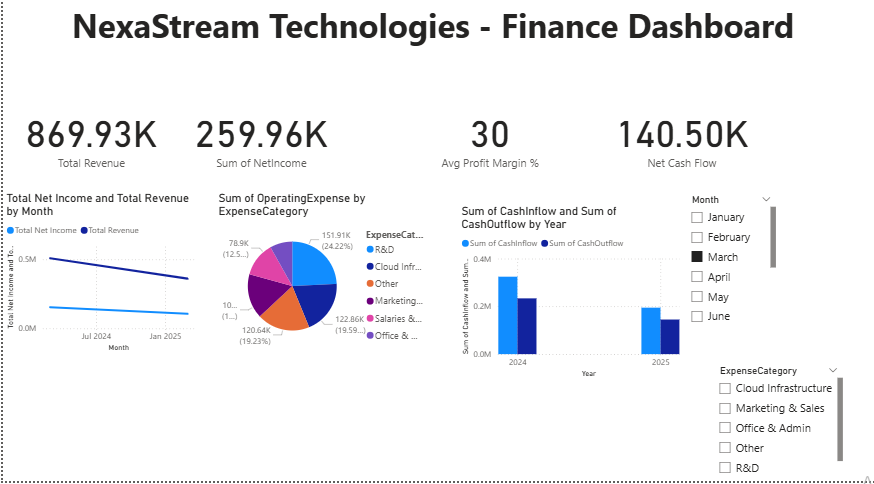
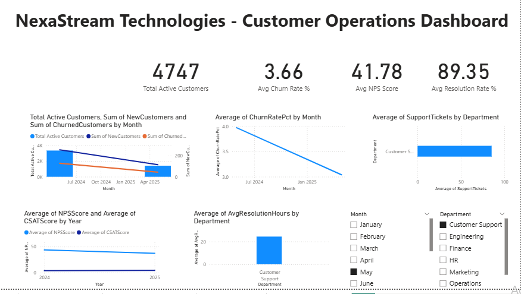
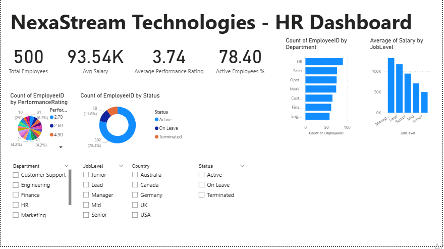
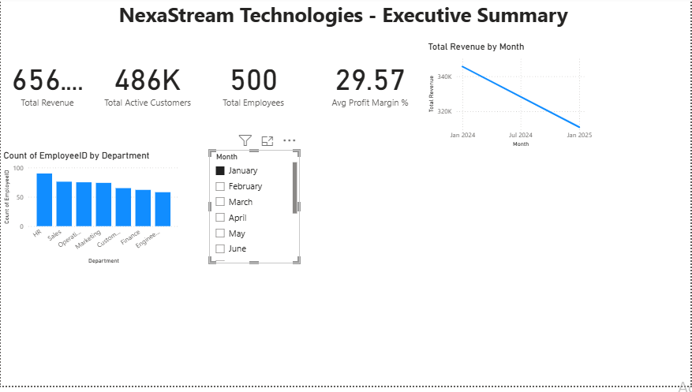

# NexaStream Technologies Dashboards

## Project Overview

| Attribute | Details |
|-----------|---------|
| Company | NexaStream Technologies |
| Industry | SaaS |
| Tool | Microsoft Power BI |
| Dashboards | 4 |

## Business Problem

NexaStream faced challenges in financial visibility, customer retention, workforce management, and decision silos.

## Datasets

Finance Data, Customer Operations Data, HR Data

## KPIs

Revenue, Net Income, Profit Margin, Active Customers, Churn Rate, NPS, Total Employees, Avg Salary

## Insights

Revenue grew 140%. Churn rate is 3.79%. 500 employees across 7 departments.

## Tools

Power BI, Excel, Python, GitHub

## Dashboard Previews

Screenshots of each dashboard are available in the `images/` folder:

| Dashboard | Preview |
|-----------|---------|
| Finance Dashboard | `images/finance_dashboard.png` |
| Customer Operations | `images/customer_operations.png` |
| HR Dashboard | `images/hr_dashboard.png` |
| Executive Summary | `images/executive_summary.png` |

## Dashboard Previews

